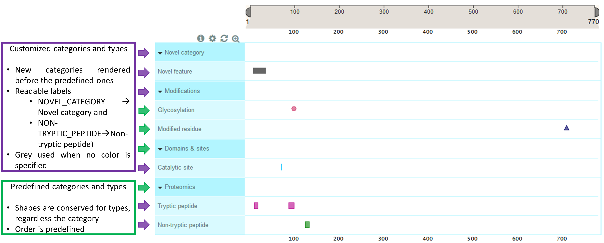
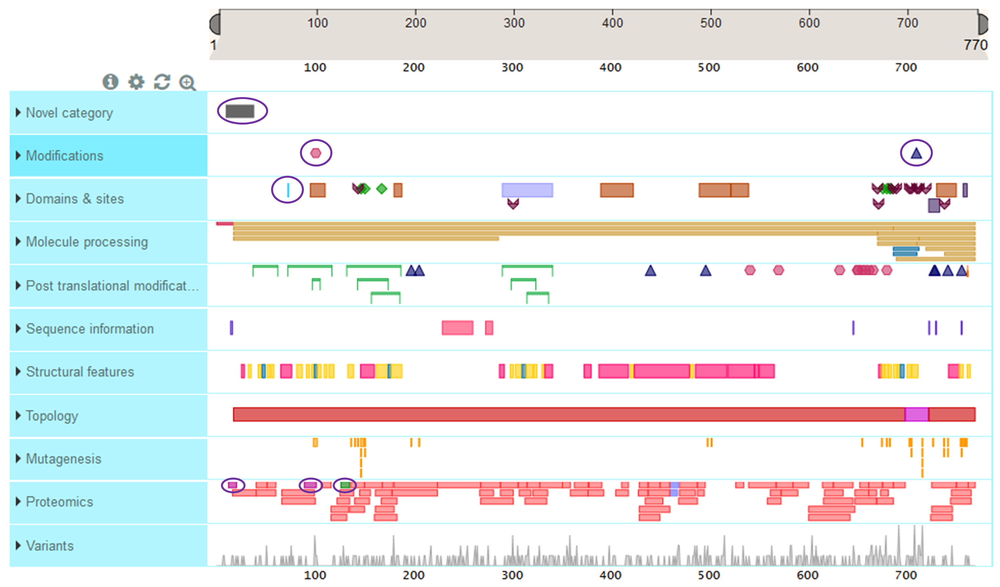
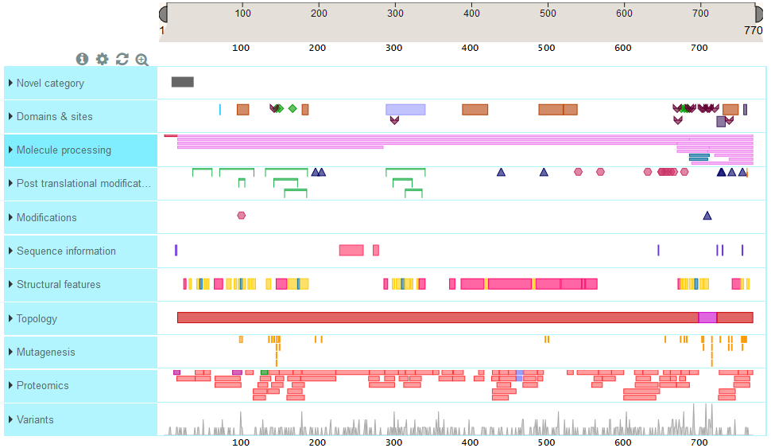

<!-- START doctoc generated TOC please keep comment here to allow auto update -->
<!-- DON'T EDIT THIS SECTION, INSTEAD RE-RUN doctoc TO UPDATE -->
**Table of Contents**  *generated with [DocToc](https://github.com/thlorenz/doctoc)*

- [Default data sources](#default-data-sources)
  - [Default categories and types](#default-categories-and-types)
  - [Excluding categories](#excluding-categories)
- [Adding your sources](#adding-your-sources)
  - [Distinguishing your features](#distinguishing-your-features)
    - [Using a color](#using-a-color)
    - [Using customized categories or types](#using-customized-categories-or-types)
  - [Further customization](#further-customization)
- [Data format](#data-format)
  - [Basic features](#basic-features)
  - [Variant visualization type](#variant-visualization-type)

<!-- END doctoc generated TOC please keep comment here to allow auto update -->

# Default data sources
By default, ProtVista uses three data [RESTful sources](http://www.ebi.ac.uk/uniprot/api/doc/index.html) provided by the Protein Function Development team. Particularly, it uses the feature data source, the variation data source and the proteomics data source.

The default data sources can be avoided when instantiating the component. Just set defaultSources to false, any other value as well as the omission of this property-key will result in loading the default data sources.

```html
<div id='yourDiv'/>
<script>
  window.onload = function() {
    var yourDiv = document.getElementById('yourDiv');
    var ProtVista = require('ProtVista');
    var instance = new ProtVista({
      el: yourDiv,
      uniprotacc: 'P05067',

      //Default sources will **not** be included
      defaultSources: false
    });
  }
</script>
```

## Default categories and types
It is important to understand what feature categories and types are supported by default. Please get familiar with the [feature categories and types supported by ProtVista](./userGuide.html#feature-categories-and-types)

## Excluding categories
You can always exclude those categories you are not interested in, for instance:

```html
<div id='yourDiv'/>
<script>
  window.onload = function() {
    var yourDiv = document.getElementById('yourDiv');
    var ProtVista = require('ProtVista');
    var instance = new ProtVista({
      el: yourDiv,
      uniprotacc: 'P05067',

      //These categories will **not** be rendered at all
      exclusions: ['PROTEOMICS', 'MOLECULE_PROCESSING','SEQUENCE_INFORMATION', 'MUTAGENESIS', 'TOPOLOGY']

    });
  }
</script>
```

# Adding your sources

**Disclaimer: ** We currently support all feature types but variants for external sources. We are working on it but it is not ready yet.

You can add your own data source by using the customDataSources option when instantiating ProtVista. Please keep in mind that the response should follow the data format expected by ProtVista. You will need to specify the URL, the authority and whether or not ".json" file extension is expected at the end of the data source call.

The protein accession will be added at the end of the URL and before the ".json" file extension (if used). The only data format supported by ProtVista is JSON. Make sure you allow Cross-origin-resource-sharing.

In the following example, we use the default UniProt data sources as well as an additional one. The additional data source call would look like https://mydomain/mysource/P05067.json

```html
<div id='yourDiv'/>
<script>
  window.onload = function() {
    var yourDiv = document.getElementById('yourDiv');
    var ProtVista = require('ProtVista');
    var instance = new ProtVista({
      el: yourDiv,

      //This will be **always** added at the end of your data source URL
      uniprotacc: 'P05067',

      //Default sources will be included (even if this option is omitted)
      defaultSources: true,

      //Your data sources are defined here
      customDataSources: [
        {
          url: 'https://mydomain/mysource/',
          authority: 'myLab',
          //Should .json be added at the end of the request URL?
          useExtension: true
        }
      ]
    });
  }
</script>
```

## Distinguishing your features
Regardless where the data come from, all features **must** have a category and a type. For instance, an "active site" in the category "Domains & sites" provided by your data source would look like

```
{
  "type": "ACT_SITE",
  "category": "DOMAINS_AND_TYPES",
  "begin": 837,
  "end": 837
}
```

And it would be rendered with the default styling options, it would look like:


You will want to able to distinguish your features from those coming from our default data sources (if used). There are different ways to achieve that.

### Using a color
You can reuse the default categories and types. If you do so, in order to distinguish your data, you could specify a color for each one of your features.

```
{
  "type": "ACT_SITE",
  "category": "DOMAINS_AND_TYPES",
  "begin": 73,
  "end": 73,
  //Color used to distinguish from default data sources features
  "color": "#33CCFF"
}
```

So the previous active site and this one together would be rendered like:


### Using customized categories or types
Additional to colors, you can also use your own categories or types. Let's consider the following features, coming from an customized data source.

```
//Predefined category, new type. Type label will be rendered as "Catalytic
site", feature will be a "#33CCFF" rectangle.
{
  "type": "CATALYTIC_SITE",
  "category": "DOMAINS_AND_SITES",
  "begin": 73,
  "end": 73,
  "color": "#33CCFF"
},

//Predefined category, new type. Type label will be rendered as "Tryptic
peptide", feature will be a "#B8008A" rectangle.
{
  "type": "TRYPTIC_PEPTIDE",
  "category": "PROTEOMICS",
  "begin": 13,
  "end": 20,
  "color": "#B8008A"
},

//Predefined category, new type. Type label will be rendered as
"Non-tryptic peptide", feature will be a "green"
rectangle.
{
  "type": "NON-TRYPTIC_PEPTIDE",
  "category": "PROTEOMICS",
  "begin": 127,
  "end": 135,
  "color": "green"
},

//Predefined category, new type. Type label will be rendered as "Tryptic
peptide", feature will be a "#B8008A"
rectangle.
{
  "type": "TRYPTIC_PEPTIDE",
  "category": "PROTEOMICS",
  "begin": 90,
  "end": 101,
  "color": "#B8008A"
},

//New category, new type. Category label will be rendered as "Novel
category", type label will be rendered as "Novel feature", feature
will be a **grey** rectangle as no color was specified.
{
  "type": "NOVEL_FEATURE",
  "category": "NOVEL_CATEGORY",
  "begin": 10,
  "end": 38
},

//New category, predefined type. Category label will be rendered
as "Modifications", type predefined label is "Glycosylation".
The predefined shape and color for CARBOHYD will be used.
{
  "type": "CARBOHYD",
  "category": "MODIFICATIONS",
  "begin": 101,
  "end": 101
},

//New category, predefined type. Category label will be rendered
as "Modifications", type predefined label is "Modified residue".
The predefined shape and color for MOD_RES will be used.
{
  "type": "MOD_RES",
  "category": "MODIFICATIONS",
  "begin": 711,
  "end": 711
}
```

If you omit the default data sources, this is how it would look like.



If you do load the default data sources, this is how it would look like. Those features coming from the customized data source are circled in purple.


## Further customization

You will need to provide a configuration file if you want to:
* Change the predefined category order (e.g., you want first proteomics, then PTM's, then your modifications)
* Change the predefined labels for categories or types (e.g., you want to see "PTM's" rather than "Post translational modification")
* Change the automatic labels for customized categories or types (e.g., you want to see "Novelties" rather than "Novel category" for the custom category "NOVEL_CATEGORY")
* Change the predefined colors for types (e.g., you want to use #FF0000 rather than #FF0066 for "Helix")
* Use a color for your own types without explicitly specifying them in the data source response (e.g., you want to specify "green" for all of yours "catalytic sites" only once)

You can specify your configuration file as an option when instantiating ProtVista.

```html
<div id='yourDiv'/>
<script>
  window.onload = function() {
    var yourDiv = document.getElementById('yourDiv');
    var ProtVista = require('ProtVista');
    var instance = new ProtVista({
      el: yourDiv,
      uniprotacc: 'P05067',
      customDataSources: [
        {
          url: 'https://mydomain/mysource/',
          authority: 'myLab',
          useExtension: true
        }
      ],
      customConfig: 'https://mydomain/mysource/myConfig.json'
    });
  }
</script>
```

The default configuration file looks like this. You will need to include there all categories and types to be configured.

The "basic" visualization type is used for all features but variants. For variants we have a specialized matrix-based visualization type "variant". No other types are currently supported.

```
{
  "categories": [
        {
          "name": "DOMAINS_AND_SITES",
          "label": "Domains & sites",
          "visualizationType": "basic"
        },
        {
          "name": "MOLECULE_PROCESSING",
          "label": "Molecule processing",
          "visualizationType": "basic"
        },
        {
          "name": "PTM",
          "label": "Post translational modifications",
          "visualizationType": "basic"
        },
        {
          "name": "SEQUENCE_INFORMATION",
          "label": "Sequence information",
          "visualizationType": "basic"
        },
        {
          "name": "STRUCTURAL",
          "label": "Structural features",
          "visualizationType": "basic"
        },
        {
          "name": "TOPOLOGY",
          "label": "Topology",
          "visualizationType": "basic"
        },
        {
          "name": "MUTAGENESIS",
          "label": "Mutagenesis",
          "visualizationType": "basic"
        },
        {
          "name": "PROTEOMICS",
          "label": "Proteomics",
          "visualizationType": "basic"
        },
        {
          "name": "VARIATION",
          "label": "Variants",
          "visualizationType": "variant"
        }
  ],
  "trackNames": {
    "chain": {
      "label": "Chain",
      "tooltip": "(aka mature region). This describes the extent of a polypeptide chain in the mature protein following processing"
    },
    "transit": {
      "label": "Transit peptide",
      "tooltip": "This describes the extent of a transit peptide"
    },
    "init_met": {
      "label": "Initiator methionine",
      "tooltip": "This indicates that the initiator methionine is cleaved from the mature protein"
    },
    "propep": {
      "label": "Propeptide",
      "tooltip": "Part of a protein that is cleaved during maturation or activation"
    },
    "peptide": {
      "label": "Peptide",
      "tooltip": "The position and length of an active peptide in the mature protein"
    },
    "signal": {
      "label": "Signal",
      "tooltip": "N-terminal signal peptide"
    },
    "helix": {
      "label": "Helix",
      "tooltip": "The positions of experimentally determined helical regions"
    },
    "strand": {
      "label": "Beta strand",
      "tooltip": "The positions of experimentally determined beta strands"
    },
    "turn": {
      "label": "Turn",
      "tooltip": "The positions of experimentally determined hydrogen-bonded turns"
    },
    "disulfid": {
      "label": "Disulfide bond",
      "tooltip": "The positions of cysteine residues participating in disulphide bonds"
    },
    "crosslnk": {
      "label": "Cross-link",
      "tooltip": "Covalent linkages of various types formed between two proteins or between two parts of the same protein"
    },
    "region": {
      "label": "Region",
      "tooltip": "Regions in multifunctional enzymes or fusion proteins, or characteristics of a region, e.g., protein-protein interactions mediation"
    },
    "coiled": {
      "label": "Coiled coil",
      "tooltip": "Coiled coils are built by two or more alpha-helices that wind around each other to form a supercoil"
    },
    "motif": {
      "label": "Motif",
      "tooltip": "Short conserved sequence motif of biological significance"
    },
    "repeat": {
      "label": "Repeat",
      "tooltip": "Repeated sequence motifs or repeated domains within the protein"
    },
    "ca_bind": {
      "label": "Calcium binding",
      "tooltip": "Calcium-binding regions, such as the EF-hand motif"
    },
    "dna_bind": {
      "label": "DNA binding",
      "tooltip": "DNA-binding domains such as AP2/ERF domain, the ETS domain, the Fork-Head domain, the HMG box and the Myb domain"
    },
    "domain": {
      "label": "Domain",
      "tooltip": "Specific combination of secondary structures organized into a characteristic three-dimensional structure or fold"
    },
    "zn_fing": {
      "label": "Zinc finger",
      "tooltip": "Small, functional, independently folded domain that coordinates one or more zinc ions"
    },
    "np_bind": {
      "label": "Nucleotide binding",
      "tooltip": "(aka flavin-binding). Region in the protein which binds nucleotide phosphates"
    },
    "metal": {
      "label": "Metal binding",
      "tooltip": "Binding site for a metal ion"
    },
    "site": {
      "label": "Site",
      "tooltip": "Any interesting single amino acid site on the sequence"
    },
    "binding": {
      "label": "Binding site",
      "tooltip": "Binding site for any chemical group (co-enzyme, prosthetic group, etc.)"
    },
    "act_site": {
      "label": "Active site",
      "tooltip": "Amino acid(s) directly involved in the activity of an enzyme"
    },
    "mod_res": {
      "label": "Modified residue",
      "tooltip": "Modified residues such as phosphorylation, acetylation, acylation, methylation"
    },
    "lipid": {
      "label": "Lipidation",
      "tooltip": "Covalently attached lipid group(s)"
    },
    "carbohyd": {
      "label": "Glycosylation",
      "tooltip": "Covalently attached glycan group(s)"
    },
    "compbias": {
      "label": "Compositional bias",
      "tooltip": "Position of regions of compositional bias within the protein and the particular amino acids that are over-represented within those regions"
    },
    "conflict": {
      "label": "Sequence conflict",
      "tooltip": "Sequence discrepancies of unknown origin"
    },
    "non_cons": {
      "label": "Non-adjacent residues",
      "tooltip": "Indicates that two residues in a sequence are not consecutive and that there is an undetermined number of unsequenced residues between them"
    },
    "non_ter": {
      "label": "Non-terminal residue",
      "tooltip": "The sequence is incomplete. The residue is not the terminal residue of the complete protein"
    },
    "unsure": {
      "label": "Sequence uncertainty",
      "tooltip": "Regions of a sequence for which the authors are unsure about the sequence assignment"
    },
    "non_std": {
      "label": "Non-standard residue",
      "tooltip": "Non-standard amino acids (selenocysteine and pyrrolysine)"
    },
    "mutagen": {
      "label": "Mutagenesis",
      "tooltip": "Site which has been experimentally altered by mutagenesis"
    },
    "topo_dom": {
      "label": "Topological domain",
      "tooltip": "Location of non-membrane regions of membrane-spanning proteins"
    },
    "transmem": {
      "label": "Transmembrane",
      "tooltip": "Extent of a membrane-spanning region"
    },
    "intramem": {
      "label": "Intramembrane",
      "tooltip": "Extent of a region located in a membrane without crossing it"
    },
    "variant": {
      "label": "Natural variant",
      "tooltip": "Natural variant of the protein, including polymorphisms, variations between strains, isolates or cultivars, disease-associated mutations and RNA editing events"
    },
    "unique": {
      "label": "Unique peptide",
      "tooltip": ""
    },
    "non_unique": {
      "label": "Non-unique peptide",
      "tooltip": ""
    }
  }
}
```

If you want, for instance, to localize your custom category MODIFICATIONS below PTM and change the default yellow-brown-ish color to a pinky one for the feature type CHAIN, you would need to modify and provide a configuration file.

You could get then a visualization like


# Data format

All data sources are expected to provide a sequence and a list of features. The sequence is mandatory so the sequence length can be loaded as soon as the first data source has been resolved. The sequence length is used for layout calculations.

This is how a response with no features looks like:

```
{
  "sequence": "MLPGLALLLLAAWTARALEVPTDGNAGLLAEPQIAMFCGRLNMHMNVQNGKWDS",
  "features": []
}
```

## Basic visualization

A basic visualization is used for all sort of features but natural variants. Here is the data format for basic features.

```
{
  "type": String - mandatory
  "category": String - mandatory - no spaces, use _ instead
  "ftId": String - optional
  "description": String - optional
  "begin": Integer string or integer - mandatory - it must be a valid position within the sequence
  "end": Integer string or integer - mandatory - it must be a valid position within the sequence
  "alternativeSequence": String - optional - useful for Mutagenesis and Conflict feature types
  "color": String - optional - will be used if provided, should be a valid color
  "evidences": Array - optional
  [
    {
       "code": String - mandatory - should be a valid ECO code
       "source": Object - optional
       {
         "name": String - mandatory
         "id": String - mandatory
         "url": String - optional - should be a valid URL
       }
    }
  ]
}
```

Examples of valid basic features:

```
"features": [
  {
    "type": "TOPO_DOM",
    "category": "TOPOLOGY",
    "description": "Cytoplasmic",
    "begin": "724",
    "end": "770",
    "evidences": [
      {
        "code": "ECO:0000255"
      }
    ]
  },
  {
    "type": "TRANSMEM",
    "category": "TOPOLOGY",
    "begin": "700",
    "end": "723"
  },
  {
    "type": "MY_TRANSMEM",
    "category": "TOPOLOGY",
    "begin": "708",
    "end": "723"
  },
  {
    "type": "ACT_SITE",
    "category": "MY_CATEGORY",
    "begin": "600",
    "end": "600",
    "color": "#00F5B8"
  },
  {
    "type": "MY_REGIOM",
    "category": "MY_CATEGORY",
    "begin": "610",
    "end": "623",
    "color": "#FF7094"
  },
  {
    "type": "SIGNAL",
    "category": "MOLECULE_PROCESSING",
    "description": "",
    "begin": "1",
    "end": "17",
    "color:" "#FF3366",
    "evidences": [
      {
        "code": "ECO:0000269",
        "source": {
          "name": "PubMed",
          "id": "12665801",
          "url": "http://www.ncbi.nlm.nih.gov/pubmed/12665801"
        }
      },
      {
        "code": "ECO:0000269",
        "source": {
          "name": "PubMed",
          "id": "2900137",
          "url": "http://www.ncbi.nlm.nih.gov/pubmed/2900137"
        }
      }
    ]
  }
]
```

## Variant visualization

The variant visualization is used only for natural variations. Using the variant visualization will result in [customized visualization for variants](./userGuide.html#natural-variant-track). Keep in mind that variants require more data than other features.

Here is the data format for the variant features:

```
{
  "type": "VARIANT" - mandatory
  "ftId": String - optional
  "description": String - optional
  "begin": Integer string or integer - mandatory - it must be a valid position within the sequence
  "end": Integer string or integer - mandatory - it must be a valid position within the sequence
  "alternativeSequence": String - mandatory - '-' must be used for deletions, '*' for stop gained and stop lost
  "wildType": String - mandatory
  "color": String - optional - will be used if provided, should be a valid color
  "polyphenPrediction": String - optional
  "polyphenScore": ​double - optional - most probably present if polyphenPrediction is known
  "siftPrediction": String - optional
  "siftScore": double - optional - most probably present if siftPrediction is known
  "sourceType": "custom_data" - mandatory - other types are allowed for data provided by UniProt
  "evidences": Array - optional
  [
    {
       "code": String - mandatory - should be a valid ECO code
       "source": Object - optional
       {
         "name": String - mandatory
         "id": String - mandatory
         "url": String - optional - should be a valid URL
       }
    }
  ],
  "xrefs": Array - optional
  [
    {
      "name": String - mandatory
      "id": String - mandatory
      "url": String - optional - should be a valid URL
    }
  ]
}
```

Examples of valid variant features:

```
"features": [
  {
      "type": "VARIANT",
      "ftId": "VAR_010109",
      "alternativeSequence": "P",
      "begin": "723",
      "end": "723",
      "wildType": "L",
      "description": "missense, known association with Alzheimer disease",
      "sourceType": "custom_data"
  },
  {
      "type": "VARIANT",
      "alternativeSequence": "R",
      "begin": "71",
      "end": "71",
      "xrefs": [
        {
          "name": "ExAC",
          "id": "rs757264249",
          "url": "http://exac.broadinstitute.org/dbsnp/rs757264249"
        }
      ],
      "wildType": "Q",
      "polyphenPrediction": "benign",
      "polyphenScore": ​0.0,
      "siftPrediction": "deleterious",
      "siftScore": ​0.02,
      "sourceType": "custom_data"
  },
  {
    "type": "VARIANT",
    "description": "primary tissue(s): large intestine",
    "alternativeSequence": "L",
    "begin": "727",
    "end": "727",
    "color": "violet",
    "xrefs": [
      {
        "name": "my_data curated",
        "id": "CUR1413494",
        "url": "http://mydomain/overview?id=1413494"
      }
    ],
    "evidences": [
      {
        "code": "ECO:0000313",
        "source": {
          "name": "internal_study",
          "id": "STUDY:376",
          "url": "http://mydomain/overview?study_id=376"
        }
      }
    ],
    "wildType": "Q",
    "polyphenPrediction": "benign",
    "polyphenScore": ​0.4,
    "siftPrediction": "deleterious",
    "siftScore": ​0.04,
    "sourceType": "custom_data"
  }
]
```

