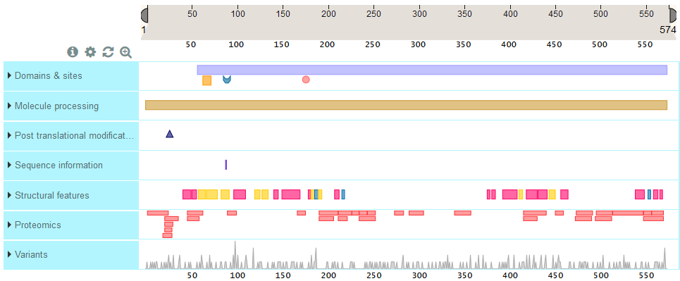
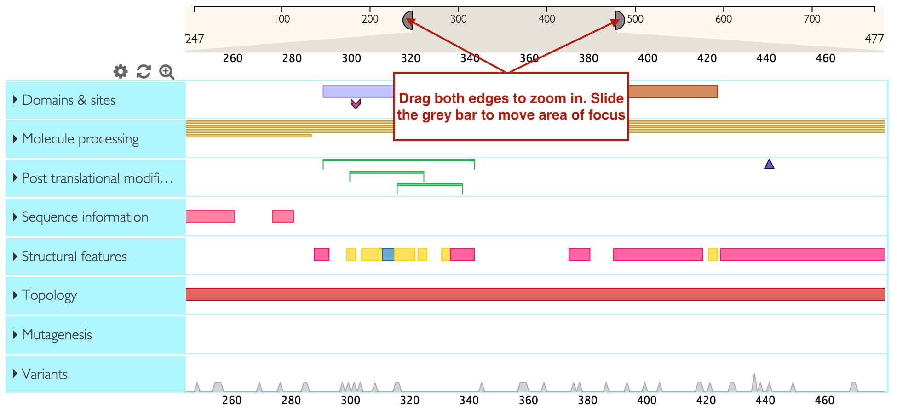
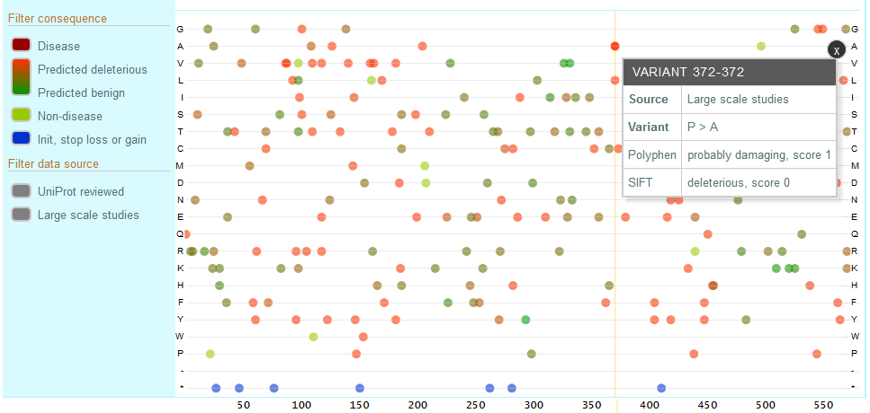

<!-- START doctoc generated TOC please keep comment here to allow auto update -->
<!-- DON'T EDIT THIS SECTION, INSTEAD RE-RUN doctoc TO UPDATE -->
**Table of Contents**  *generated with [DocToc](https://github.com/thlorenz/doctoc)*

- [Interaction and customization](#interaction-and-customization)
  - [Zoom](#zoom)
  - [Shapes and colors of features](#shapes-and-colors-of-features)
  - [Getting more information on track names and features](#getting-more-information-on-track-names-and-features)
  - [Customize](#customize)
  - [Natural variants track](#natural-variants-track)
- [Feature categories and types](#feature-categories-and-types)

<!-- END doctoc generated TOC please keep comment here to allow auto update -->

## Interaction and customization

ProtVista presents sequence feature tracks under a ruler that represents sequence length for this protein. The track names are listed on the left hand side and the sequence features are shown in the horizontal track under the ruler.

You can expand a feature track to view all the sub-category titles by clicking on the blue area with the track name. In the example below, 'Domains & Sites' expands into 'Domain', 'Binding site', Active site' and 'Nucleotide binding site.

### Zoom

You can zoom into a feature track right at various levels by double clicking on the feature you are interested, using your mouse zoom function or dragging the edges of the ruler into the area that you wish to zoom into. You can then slide the selected area on the ruler to focus on your area of interest.

You can directly zoom in to the level of the sequence (maximum possible zoom resolution) by clicking on the  icon.

### Shapes and colors of features

Sequence features that generally span multiple amino acids (like domains) are represented by rectangles. Other shapes represent sequence features that generally span only one amino acid. For example in the screenshot below, the purple rectangle represents a domain and the pink circle represents an active site. One track can have several sub-categories of features grouped inside it. Each feature sub-category has a dedicated color (for example 'active site' will have a different color to 'binding site').

### Getting more information on track names and features

To learn more about a feature track's name or or sub-category's name and definition, hover over the title with your mouse.

To get more information about a sequence feature, click on it and you will see an info-box as shown below. You will also see a yellow highlight across the area occupied by the sequence feature so that you can easily see which other features overlap with it. Any selections can be reset by clicking on the white space in the tracks or by clicking on the  icon.

### Customize

You can customize the tracks that you see by clicking on the  icon. You will see the list of all tracks with checkboxes to the left. You can deselect a checkbox in order to remove a track from view and select it to add the track back.

### Natural variants track

The natural variants track shows natural variants from UniProt annotations as well as Large Scale Studies ([COSMIC](http://cancer.sanger.ac.uk/cosmic), [1000 Genomes](http://www.1000genomes.org/), [Exome Sequencing Project](http://evs.gs.washington.edu/EVS/), [ExAC](http://exac.broadinstitute.org/)). The default track view shows a summary chart indicating the number of variants at each sequence position. For example, the peaks show areas of high variation.

To expand the variants track and see all individual variants, click on the 'Natural variants' title area. You will now see each a chart where the x-axis consists of the sequence positions and the y-axis consists of all possible amino acids (shown below). All natural variants found for your protein are plotted on this chart, represented by colored circles. The variants are color coded by deleteriousness and source, with the exact legend shown on the left hand in the track title area.

You can filter the variants to see those curated by UniProt (UniProt Reviewed) or Large Scale Study variants. You can also filter by consequence and choose disease associated, predicted deleterious to predicted benign, non-disease associated and variants affecting the initiator codon, stop loss or stop gain.

Click on a variant to view more details about the variants including the exact sequence change, the evidence, source and identifiers.

## Feature categories and types
Feature types are grouped in categories. Here we present the list of the currently supported feature categories and types.

**Category name: DOMAIN_AND_SITES. Label: Domains & sites**

**Type** | **Label** | **Description** | **Shape**
--- | --- | --- | :---: |
[domain](http://www.uniprot.org/help/domain) | Domain | Position and type of each modular protein domain | rectangle
[repeat](http://www.uniprot.org/help/repeat) | Repeat | Positions of repeated sequence motifs or repeated domains | rectangle
[ca_bind](http://www.uniprot.org/help/ca_bind) | Calcium binding | Position(s) of calcium binding region(s) within the protein | rectangle
[zn_fing](http://www.uniprot.org/help/zn_fing) | Zinc finger | Position(s) and type(s) of zinc fingers within the protein | rectangle
[dna_bind](http://www.uniprot.org/help/dna_bind) | DNA binding | Position and type of a DNA-binding domain | rectangle
[np_bind](http://www.uniprot.org/help/np_bind) | Nucleotide binding | Nucleotide phosphate binding region | rectangle
[region](http://www.uniprot.org/help/region) | Region | Region of interest in the sequence | rectangle
[coiled](http://www.uniprot.org/help/coiled) | Coiled coil | Positions of regions of coiled coil within the protein | rectangle
[motif](http://www.uniprot.org/help/motif) | Motif | Short (up to 20 amino acids) sequence motif of biological interest | rectangle
[act_site](http://www.uniprot.org/help/act_site) | Active site | Amino acid(s) directly involved in the activity of an enzyme |  | 
[metal](http://www.uniprot.org/help/metal) | Metal binding | Binding site for a metal ion |  | 
[binding](http://www.uniprot.org/help/binding) | Binding site | Binding site for any chemical group (co-enzyme, prosthetic group, etc.) |  |
[site](http://www.uniprot.org/help/site) | Site | Any interesting single amino acid site on the sequence |  |

 **Category name: MOLECULE_PROCESSING. Label: Molecule processing**

 **Type** | **Label** | **Description** | **Shape**
 --- | --- | --- | :---: |
[init_met](http://www.uniprot.org/help/init_met) | Initiator methionine |  Cleavage of the initiator methionine |  |
[signal](http://www.uniprot.org/help/signal) | Signal | Sequence targeting proteins to the secretory pathway or periplasmic space | rectangle
[transit](http://www.uniprot.org/help/transit) | Transit peptide | Extent of a transit peptide for organelle targeting | rectangle
[propep](http://www.uniprot.org/help/propep) | Propeptide | Part of a protein that is cleaved during maturation or activation | rectangle
[chain](http://www.uniprot.org/help/chain) | Chain | Extent of a polypeptide chain in the mature protein | rectangle
[peptide](http://www.uniprot.org/help/peptide) | Peptide | Extent of an active peptide in the mature protein | rectangle

**Category name: PTM. Label: Post translational modifications**

**Type** | **Label** | **Description** | **Shape**
 --- | --- | --- | :---: |
[mod_res](http://www.uniprot.org/help/mod_res) | Modified residue | Modified residues excluding lipids, glycans and protein cross-links |  |
[lipid](http://www.uniprot.org/help/lipid) | Lipidation | Covalently attached lipid group(s) |  |
[carbohyd](http://www.uniprot.org/help/carbohyd) | Glycosylation | Covalently attached glycan group(s) |  |
[disulfid](http://www.uniprot.org/help/disulfid) | Disulfide bond | Cysteine residues participating in disulfide bonds |  |
[crosslnk](http://www.uniprot.org/help/crosslnk) | Cross-link | Residues participating in covalent linkage(s) between proteins |  |

**Category name: SEQUENCE_INFORMATION. Label: Sequence information**

**Type** | **Label** | **Description** | **Shape**
 --- | --- | --- | :---: |
[compbias](http://www.uniprot.org/help/compbias) | Compositional biased | Region of compositional bias in the protein | rectangle
[non_std](http://www.uniprot.org/help/non_std) | Non-standard residue | Occurrence of non-standard amino acids (selenocysteine and pyrrolysine) in the protein sequence |  | 
[unsure](http://www.uniprot.org/help/unsure) | Sequence uncertainty | Regions of uncertainty in the sequence | rectangle
[conflict](http://www.uniprot.org/help/conflict) | Sequence conflict | Description of sequence discrepancies of unknown origin | rectangle
[non_cons](http://www.uniprot.org/help/non_cons) | Non-adjacent residues | Indicates that two residues in a sequence are not consecutive |  |
[non_ter](http://www.uniprot.org/help/non_ter) | Non-terminal residue | The sequence is incomplete. Indicate that a residue is not the terminal residue of the complete protein |  |

**Category name: STRUCTURAL. Label: Structural features**

**Type** | **Label** | **Description** | **Shape**
 --- | --- | --- | :---: |
[helix](http://www.uniprot.org/help/helix) | Helix | Helical regions within the experimentally determined protein structure | rectangle
[turn](http://www.uniprot.org/help/turn) | Turn | Turns within the experimentally determined protein structure | rectangle
[strand](http://www.uniprot.org/help/strand) | Beta strand | Beta strand regions within the experimentally determined protein structure | rectangle

**Category name: TOPOLOGY. Label: Topology**

**Type** | **Label** | **Description** | **Shape**
 --- | --- | --- | :---: |
[topo_dom](http://www.uniprot.org/help/topo_dom) | Topological domain | Location of non-membrane regions of membrane-spanning proteins | rectangle
[transmem](http://www.uniprot.org/help/transmem) | Transmembrane | Extent of a membrane-spanning region | rectangle
[intramem](http://www.uniprot.org/help/intramem) | Intramembrane | Extent of a region located in a membrane without crossing it | rectangle

**Category name: MUTAGENESIS. Label: Mutagenesis**

**Type** | **Label** | **Description** | **Shape**
 --- | --- | --- | :---: |
[mutagen](http://www.uniprot.org/help/mutagen) | Mutagenesis | Site which has been experimentally altered by mutagenesis | rectangle

**Category name: PROTEOMICS. Label: Proteomics**

**Type** | **Label** | **Description** | **Shape**
 --- | --- | --- | :---: |
[unique](ftp://ftp.uniprot.org/pub/databases/uniprot/current_release/knowledgebase/proteomics_mapping/README) | Unique peptides | Unique peptides based on peptide evidence mapped from mass-spectrometry proteomics services (PeptideAtlas, EPD and MaxQB) to UniProtKB sequences | rectangle
[non-unique](ftp://ftp.uniprot.org/pub/databases/uniprot/current_release/knowledgebase/proteomics_mapping/README) | Non-unique peptides | Non-unique peptides based on peptide evidence mapped from mass-spectrometry proteomics services (PeptideAtlas, EPD and MaxQB) to UniProtKB sequences | rectangle

**Category name: VARIATION. Label: Variants**

**Type** | **Label** | **Description** | **Shape**
 --- | --- | --- | :---: |
[variant](http://www.uniprot.org/help/variant) | Natural variant | Description of a natural variant of the protein | circle

