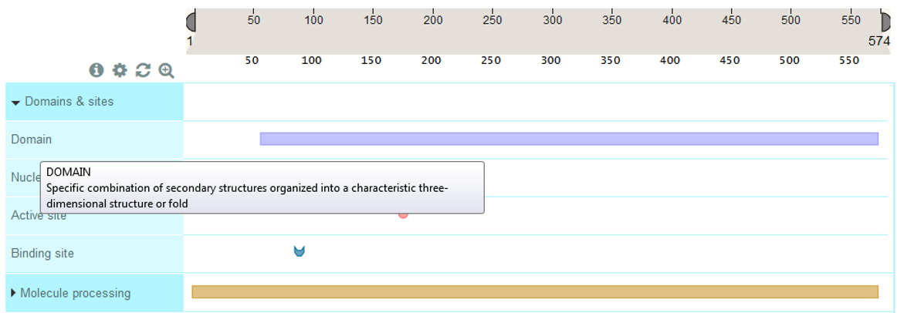
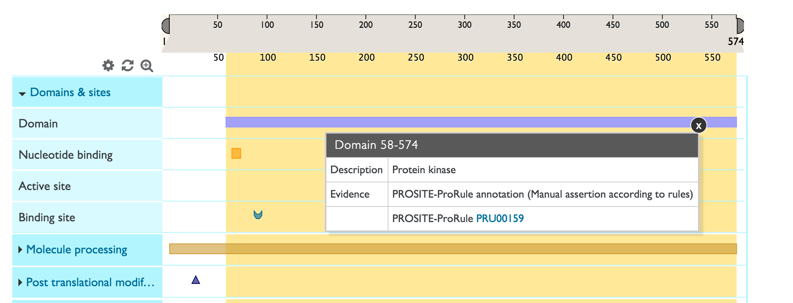
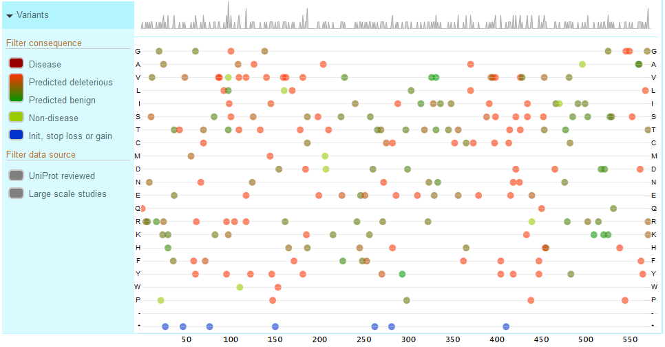

# Feature viewer

## Feature tracks

The Feature viewer presents sequence feature tracks under a ruler that represents sequence length for this protein. The track names are listed on the left hand side and the sequence features are shown in the horizontal track under the ruler.

You can expand a feature track to view to view all the sub-category titles by clicking on the blue area with the track name. In the example below, 'Domains & Sites' expands into 'Domain', 'Binding site', Active site' and 'Nucleotide binding site.

### Customise

You can customise the tracks that you see by clicking on the  icon. You will see the list of all tracks with checkboxes to the left. You can deselect a checkbox in order to remove a track from view and select it to add the track back.

### Zoom

You can zoom into a feature track right at various levels by double clicking on the feature you are interested, using your mouse zoom function or dragging the edges of the ruler into the area that you wish to zoom into. You can then slide the selected area on the ruler to focus on your area of interest.

You can directly zoom in to the level of the sequence (maximum possible zoom resolution) by clicking on the  icon.

### Shapes and colours of features

Sequence features that generally span multiple amino acids (like domains) are represented by rectangles. Other shapes represent sequence features that generally span only one amino acid. For example in the screenshot below, the purple rectangle represents a domain and the pink circle represents an active site. One track can have several sub-categories of features grouped inside it. Each feature sub-category has a dedicated colour (for example 'active site' will have a different colour to 'binding site').

### Getting more information on track names and features

To learn more about a feature track's name or or sub-category's name and definition, hover over the title with your mouse.

To get more information about a sequence feature, click on it and you will see an info-box as shown below. You will also see a yellow highlight across the area occupied by the sequence feature so that you can easily see which other features overlap with it. Any selections can be reset by clicking on the white space in the tracks or by clicking on the  icon.

### Natural variant track

The natural variants track shows natural variants from UniProt annotations as well as Large Scale Studies ([COSMIC](http://cancer.sanger.ac.uk/cosmic), [1000 Genomes](http://www.1000genomes.org/), [Exome Sequencing Project](http://evs.gs.washington.edu/EVS/), [ExAC](http://exac.broadinstitute.org/). The default track view shows a summary chart indicating the number of variants at each sequence position. For example, the peaks show areas of high variation.

To expand the variants track and see all individual variants, click on the 'Natural variants' title area. You will now see each a chart where the x-axis consists of the sequence positions and the y-axis consists of all possible amino acids (shown below). All natural variants found for your protein are plotted on this chart, represented by coloured circles. The variants are colour coded by deleteriousness and source, with the exact legend shown on the left hand in the track title area.

You can filter the variants to only see those curated by UniProt (UniProt Reviewed), within which you can choose disease associated or non-disease associated ones, or only see Large Scale Study variants.

Click on a variant to view more details about the variants including the exact sequence change, the evidence, source and identifiers.

